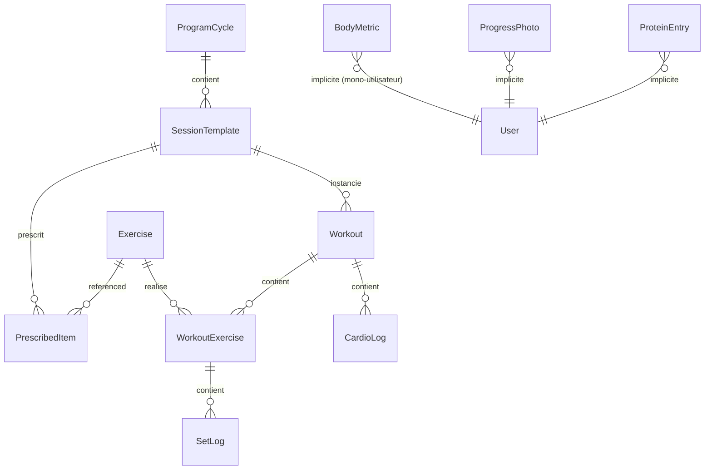

# 04 — Modèle de données

**Projet** : HERY
**Version** : 1.0 — 8 août 2026

---

## 1. Principes

1. **Prescription ≠ réalisation.** `PrescribedItem` décrit ce qui est prévu, `WorkoutExercise` + `SetLog` décrivent ce qui a été fait. Fusionner les deux rend le programme non modifiable sans réécrire l'historique — c'est l'erreur structurante la plus fréquente sur ce type d'application.
2. **Les séries loguées sont immuables** (hors correction explicite, tracée). Les valeurs dérivées coûteuses — e1RM, statut de PR — sont calculées à l'écriture et stockées.
3. **Prêt pour la synchronisation, sans synchronisation.** ULID côté client, `createdAt` / `updatedAt` / `deletedAt` partout, aucune clé auto-incrémentée.
4. **Les unités sont dans le nom des champs.** Aucune ambiguïté possible.

## 2. Diagramme



## 3. Champs communs

Toutes les entités portent :

| Champ | Type | Rôle |
|---|---|---|
| `id` | `string` (ULID) | Identifiant, généré côté client, triable chronologiquement |
| `createdAt` | `string` ISO 8601 UTC | |
| `updatedAt` | `string` ISO 8601 UTC | Base de la future résolution de conflit |
| `deletedAt` | `string \| null` | Suppression logique. Aucun `delete` physique |

## 4. Entités

### `Exercise` — catalogue

| Champ | Type | Notes |
|---|---|---|
| `name` | `string` | « Presse à cuisses » |
| `equipment` | `'machine' \| 'barbell' \| 'dumbbell' \| 'cable' \| 'bodyweight' \| 'smith' \| 'cardio'` | Alimente la substitution |
| `primaryMuscles` | `MuscleGroup[]` | Coefficient 1,0 |
| `secondaryMuscles` | `MuscleGroup[]` | Coefficient 0,5 |
| `unilateral` | `boolean` | Fentes, gainage latéral → charge saisie par côté |
| `loadType` | `'weight' \| 'time' \| 'reps' \| 'distance'` | Gainage = `time`, relevés de genoux = `reps` |
| `defaultIncrementKg` | `number` | 2,5 machine/barre · 1,25 haltère · 5 presse |
| `alternativeIds` | `string[]` | 3 à 5 substituts de même fonction |
| `cues` | `string[]` | Consignes techniques, affichées au premier usage |

`MuscleGroup` : `quadriceps`, `ischios`, `fessiers`, `mollets`, `pectoraux`, `dorsaux`, `trapezes`, `deltoides_ant`, `deltoides_lat`, `deltoides_post`, `biceps`, `triceps`, `avant_bras`, `abdominaux`, `obliques`, `lombaires`.

### `ProgramCycle` — cycle d'entraînement

| Champ | Type | Notes |
|---|---|---|
| `name` | `string` | « Full Body 3 mois — reprise » |
| `startDate` | `string` (date) | |
| `weeks` | `number` | 12 |
| `phases` | `Phase[]` | `{ code: 'readaptation' \| 'progression' \| 'intensification', fromWeek, toWeek, rules }` |
| `active` | `boolean` | Un seul cycle actif à la fois |

### `SessionTemplate` — séance type

| Champ | Type | Notes |
|---|---|---|
| `cycleId` | `string` | |
| `code` | `'A' \| 'B' \| 'C'` | |
| `label` | `string` | « Séance A — Full Body » |
| `dayOfWeek` | `1..7` | 1 = lundi |
| `targetDurationMin` | `number` | 75 |

### `PrescribedItem` — ligne du programme

| Champ | Type | Notes |
|---|---|---|
| `sessionTemplateId` | `string` | |
| `order` | `number` | Ordre d'exécution, tous blocs confondus |
| `kind` | `'warmup' \| 'strength' \| 'core' \| 'cardio' \| 'stretch'` | |
| `exerciseId` | `string \| null` | `null` pour un item d'échauffement libre |
| `label` | `string` | Utilisé si `exerciseId` est nul |
| `sets` | `number \| null` | |
| `repsTarget` | `number \| null` | |
| `repsRangeMin/Max` | `number \| null` | Pour les fourchettes (10-12) |
| `durationSec` | `number \| null` | Gainage, cardio |
| `restSec` | `number` | 60 à 90 |
| `perSide` | `boolean` | Fentes, gainage latéral |
| `notes` | `string` | « léger », « garder 2-3 reps en réserve » |

### `Workout` — séance réalisée

| Champ | Type | Notes |
|---|---|---|
| `sessionTemplateId` | `string \| null` | `null` = séance libre |
| `templateSnapshot` | `PrescribedItem[]` | **Copie figée** de la prescription du jour (`RG-04`) |
| `date` | `string` (date) | |
| `startedAt` / `endedAt` | `string \| null` | |
| `status` | `'in_progress' \| 'completed' \| 'abandoned'` | |
| `bodyweightKg` | `number \| null` | Saisi une fois par semaine, pas par séance |
| `totalTonnageKg` | `number` | Calculé à la clôture |
| `notes` | `string` | |

### `WorkoutExercise` — exercice réalisé

| Champ | Type | Notes |
|---|---|---|
| `workoutId` | `string` | |
| `exerciseId` | `string` | Exercice **réellement** effectué |
| `substitutedFromId` | `string \| null` | Exercice initialement prescrit (`RG-10`) |
| `order` | `number` | |
| `machineSettings` | `string` | « Siège 4, cale-cuisses 3 » — rappelé automatiquement |
| `sessionRpe` | `6 \| 8 \| 9.5 \| null` | Demandé une fois, en fin d'exercice (`RG-11`) |
| `note` | `string` | Douleur, sensation |

### `SetLog` — série

| Champ | Type | Notes |
|---|---|---|
| `workoutExerciseId` | `string` | |
| `index` | `number` | 1, 2, 3… |
| `weightKg` | `number \| null` | `null` si `loadType` ≠ `weight` |
| `reps` | `number \| null` | |
| `durationSec` | `number \| null` | Gainage |
| `rir` | `number \| null` | Dérivé du RPE d'exercice |
| `tempo` | `string \| null` | « 2-0-1-0 » — V1 |
| `restActualSec` | `number \| null` | Mesuré — V1 |
| `isWarmup` | `boolean` | Exclu du tonnage, du volume et des PR |
| `e1rm` | `number \| null` | **Calculé à l'écriture, jamais recalculé** (`RG-14`) |
| `isPR` | `boolean` | Calculé à l'écriture |
| `prKinds` | `('weight' \| 'reps' \| 'e1rm' \| 'volume')[]` | |
| `completedAt` | `string` | Sert aussi à mesurer le temps de saisie |
| `editedAt` | `string \| null` | Correction a posteriori (`RG-12`) |

### `CardioLog`

| Champ | Type | Notes |
|---|---|---|
| `workoutId` | `string` | |
| `modality` | `'marche_inclinee' \| 'velo' \| 'rameur' \| 'elliptique' \| 'tapis'` | |
| `durationMin` | `number` | |
| `avgHrBpm` | `number \| null` | Cible 110-130 |
| `inclinePct` / `resistance` / `distanceKm` | `number \| null` | |

### `BodyMetric`

`date`, `weightKg`, `waistCm`, `chestCm`, `armCm`, `thighCm`, `hipCm` — tous optionnels.
Le **tour de taille** est l'indicateur principal de composition (`RG-18`).

### `ProgressPhoto`

`date`, `pose` (`front` / `side` / `back`), `blob` (≤ 250 ko, compressé côté client), `weightKg`.
Ne quitte jamais l'appareil (`RG-19`).

### `ProteinEntry` — V1

`date`, `label`, `grams`, `presetId`. Alimenté par les préréglages personnels de l'utilisateur.

### `Setting`

Table clé/valeur : cible protéines quotidienne, incréments personnalisés, date du dernier export, préférences d'affichage, version du seed chargé.

## 5. Formules

| Grandeur | Formule | Contrainte |
|---|---|---|
| **e1RM** (Epley) | `weightKg × (1 + reps / 30)` | Non calculé au-delà de 12 reps (`RG-13`) |
| **Tonnage d'une série** | `weightKg × reps` (× 2 si unilatéral) | Séries d'échauffement exclues |
| **Tonnage d'une séance** | Somme des tonnages de séries | |
| **Volume d'un muscle** | `Σ (séries effectives × coefficient)` sur la période | Primaire 1,0 · secondaire 0,5 (`RG-02`, `RG-15`) |
| **PR de charge** | `weightKg` > max historique sur l'exercice, `reps` ≥ 1 | Hors échauffement (`RG-16`) |
| **PR de reps** | `reps` > max historique à `weightKg` égal ou supérieur | |
| **PR d'e1RM** | `e1rm` > max historique sur l'exercice | |
| **Ratio d'équilibre** | `volume(A) / volume(B)` sur 4 semaines | Alerte hors [0,7 ; 1,4] (`RG-17`) |
| **Progression de phase** | Mois 2 : +5 à 10 % si toutes les reps atteintes | Plafond +10 %/4 semaines (`C-07`) |

## 6. Invariants

| # | Invariant |
|---|---|
| I-01 | Un `SetLog` appartient toujours à un `WorkoutExercise` existant et non supprimé |
| I-02 | Les `index` des séries d'un même exercice sont contigus à partir de 1 |
| I-03 | Un `Workout` en `in_progress` est unique à un instant donné |
| I-04 | `templateSnapshot` est renseigné dès la création du `Workout` et n'est jamais modifié |
| I-05 | Une série avec `isWarmup = true` a `isPR = false` et n'entre dans aucun agrégat |
| I-06 | `e1rm` est nul si `reps > 12` ou si `weightKg` est nul |
| I-07 | Un seul `ProgramCycle` porte `active = true` |
| I-08 | `deletedAt` non nul exclut l'entité de toutes les lectures applicatives |

## 7. Cycle de vie d'une série (le chemin critique)

```
Tap VALIDER
   │
   ├─ 1. Construire le SetLog (ULID, timestamps)
   ├─ 2. Calculer e1rm                        [domain/e1rm.ts]
   ├─ 3. Évaluer le statut de PR              [domain/records.ts]
   ├─ 4. Écrire en base (Dexie, sans await bloquant l'UI)
   ├─ 5. Mettre à jour l'UI de façon optimiste
   ├─ 6. Vibration + son
   └─ 7. Armer le timer de repos (restEndsAt persisté)

Budget total perçu par l'utilisateur : 0 ms.
```

## 8. Migrations

| Version | Contenu | Statut |
|---|---|---|
| 1 | Schéma V0 : catalogue, programme, séance, journal | à livrer |
| 2 | RPE, tempo, temps de repos réel | V1 |
| 3 | Mesures corporelles, photos, protéines | V1 |
| 4 | Champs de synchronisation additionnels | V2 |

Règles : jamais de modification d'une version livrée · `upgrade()` explicite · test de migration écrit avant le code · aucun champ supprimé.

## 9. Format d'export

```json
{
  "app": "hery",
  "schemaVersion": 1,
  "exportedAt": "2026-08-31T18:42:00Z",
  "counts": { "workouts": 12, "setLogs": 284 },
  "data": {
    "exercises": [], "cycles": [], "sessionTemplates": [], "prescribedItems": [],
    "workouts": [], "workoutExercises": [], "setLogs": [], "cardioLogs": [],
    "bodyMetrics": [], "proteinEntries": [], "settings": []
  },
  "photos": "photos exportées séparément (archive), jamais en base64 dans ce fichier"
}
```

L'export est toujours complet (`RG-24`). L'import demande explicitement `remplacer` ou `fusionner` (`RG-25`).
